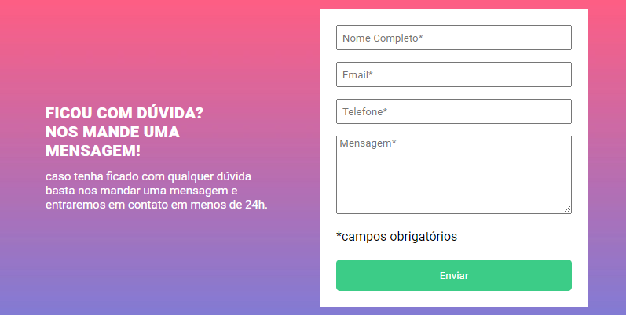
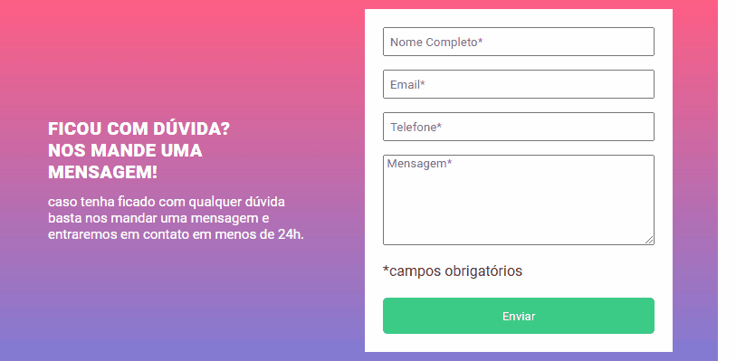

# OBJETIVO DO PROJETO

Cumprir com todas as exigências feitas pelo curso do DEVQUEST da melhor maneira e para realizar o código mais simples e fácilde compreender, além de ser fácil para dar manutenção.

# RESULTADO

